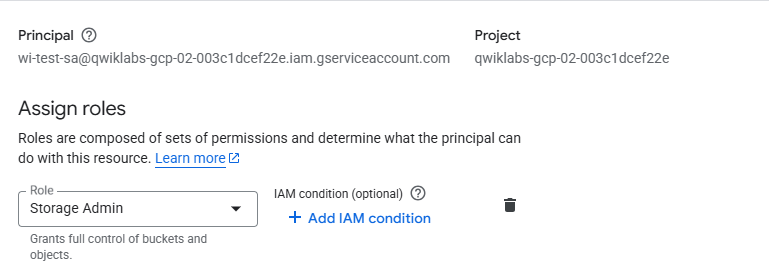

# Instructions

### Prerequisites
 Create GKE cluster, GCS bucket and create a service account and assign `roles/storage.admin` role to list buckets. 

### Service account impersonation

```
gcloud iam service-accounts add-iam-policy-binding <GCP_SA> \
    --role roles/iam.workloadIdentityUser \
    --member "serviceAccount:<PROJECT_ID>.svc.id.goog[wi-test-ns/gcs-access-sa]"
```

`wi-test-ns` is namespace and `gcs-access-sa` is kubernetes service account name.

###  Fetch credentials for cluster
```
gcloud auth login 
gcloud container clusters get-credentials <CLUSTER_NAME> --region <CLUSTER_REGION> --project <PROJECT_ID>
```

### Create Namespace 
All workloads will be deployed under the namespace `wi-test-ns`

``` 
kubectl config current-context
kubectl create namespace wi-test-ns
```

### Create imagePullSecret 

```
kubectl apply -f imagepullsecret.yaml -n wi-test-ns
```

```yaml
# imagepullsecret.yaml

apiVersion: v1
kind: Secret
metadata:
  name: gh-cred
type: kubernetes.io/dockerconfigjson
data:
  .dockerconfigjson: |
  <BASE64_ENCODED_DOCKER_CONFIG_JSON>
```

### HELM release

Update ProjectID and GCP service account in `helm/values.yaml` and create helm chart.

``` 
helm package /helm                                      
helm install [HELM_RELEASE_NAME] [CHART] --namespace wi-test-ns
```

### Debugging help

 
